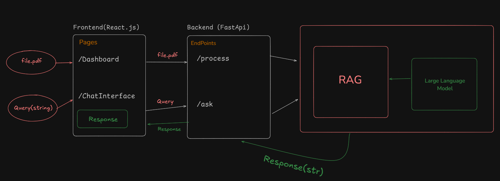

# Talk-DF

A full-stack AI-powered web application that allows users to upload PDF documents and ask questions based on their content using RAG (Retrieval-Augmented Generation) with LangChain and LLM integration.

## Features

- Upload PDF documents from the frontend

- Ask natural language questions based on PDF content

- Uses LangChain with vector embeddings and RAG to generate accurate answers

- Real-time Q&A chat interface

- Clean UI with feedback states (uploading, processing, typing...)

- Robust FastAPI backend handling PDF processing, vector storage, and question handling

## Tech Stack

### Frontend

- React.js
- TailwindCSS
- React Router

### Backend

- FastAPI

- LangChain

- PyMuPDF (for PDF text extraction)

- FAISS (for vector embeddings)

- LLM : llama 3.2

## File Structure

```bash
/frontend
  ├── src/
  │   ├── Chat.jsx
  │   ├── Dashboard.jsx
  │   └── App.jsx

Backend/
├── services/
│   ├── uploads/
│   ├── vectorstore/
│   ├── pdf_text_handler.py
│   ├── server.py
│   └── test.py

```

## Installation & Setup

### Backend Setup

```bash
cd backend
python -m venv venv
source \Scripts\activate
pip install -r requirements.txt
uvicorn main:app --reload
```

### Frontend Setup

```bash
cd frontend
npm install
npm run dev
```

## API Endpoint

`POST /process`

- Accepts: PDF File

- Action: Extracts text, creates vector embeddings, initializes conversation chain

`POST /ask`

- Accepts: { question: "your question" }

- Action: Uses LangChain to answer question based on the uploaded document

## System Achitecture



- User uploads a PDF

- Backend extracts text using PyMuPDF

- Vector embeddings are created using LangChain

- Vectors are stored in memory (FAISS)

- User sends a question → LangChain retrieves relevant chunks using similarity search

- LLM (llama 3.2) generates the final response

- Response is displayed in the chat UI

## Limitations

- While the application demonstrates a fully functional end-to-end RAG pipeline, there are a few known limitations:

- Local Model Performance: Running embedding models and LLMs locally can be resource-intensive and slow, especially on machines without dedicated GPUs.

- Response Time: The time taken to generate responses can be significant due to local vector search and model inference delays.

- OpenAI Integration (Optional): Using OpenAI’s hosted models (via API) significantly improves response time and output quality, but may require a valid API key and incurs usage costs.

## 📌 Note to Reviewer

I’d like to sincerely request your understanding regarding the runtime performance shown in my demo video. Due to hardware limitations — I’m currently working on an older, low-spec laptop — the locally hosted AI models (for embedding and response generation) take longer than expected to process queries.

While the core functionality and code logic are fully implemented and correct, the slower runtime is purely a result of limited system resources. If this application were integrated with a production-grade LLM like OpenAI (which I avoided due to cost), the response time and user experience would have been significantly faster.

I am planning to upgrade to a new machine by next month and will re-optimize performance and deploy the app using hosted models. Thank you for your patience and consideration.

## Author

Prateek Shukla
🔗 [Linked In](www.linkedin.com/in/prateekshukla17)
